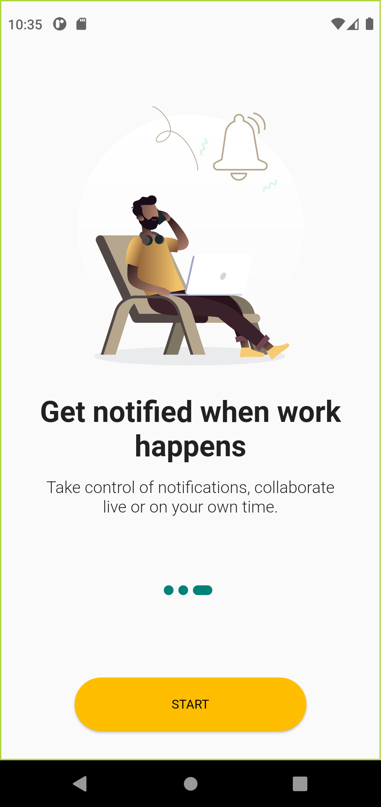
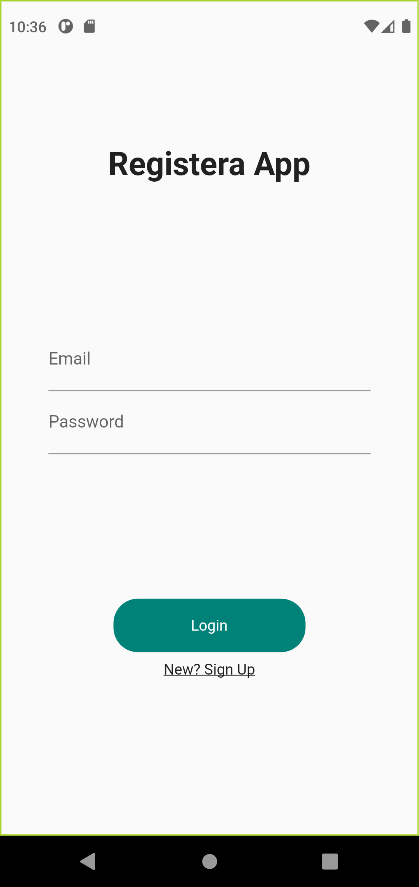
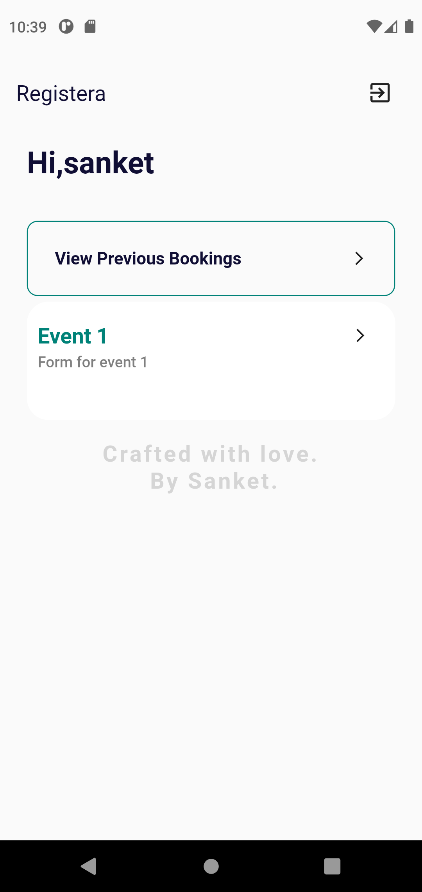
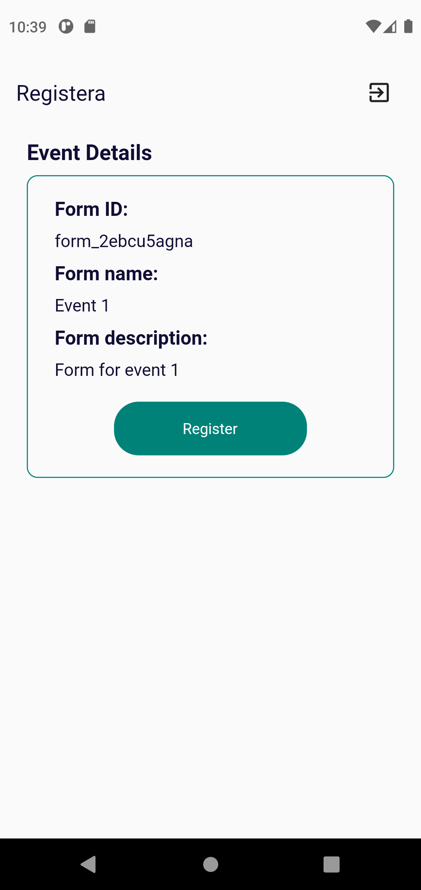
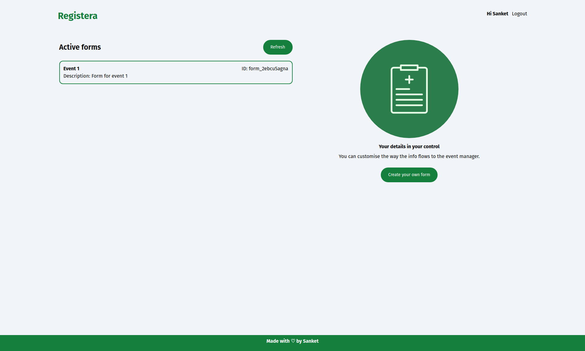
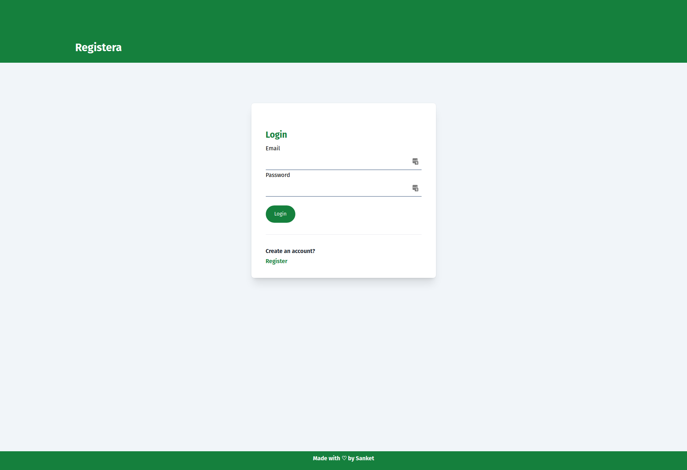
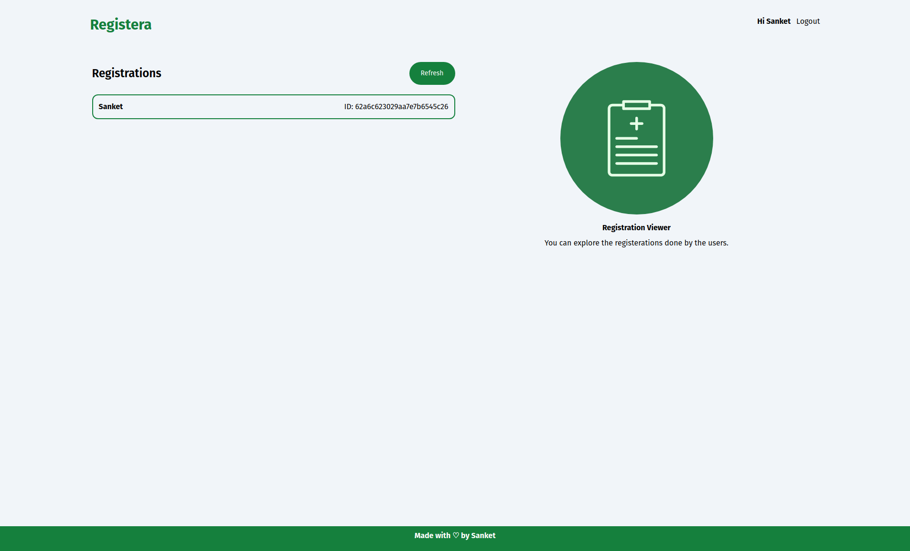

# Registera

A simple NodeJS (TypeScript) based backend coupled with Flutter based mobile app for sample multipurpose registeration management app.

## Tech stack

### Backend - 
  - NodeJS (Typescript)
  - Typegoose (MongoDB)
  - Express (server)
  - TypeGraphQL (Typesafe Graphql)
  - Apollo Graphql (graphql engine) 

### Mobile App - 
  - Flutter 3.0.1
  - Provider for state management
  - flutter-graphql for graphql queries and mutation 
  - Dio for REST based API communication
  - Shared Preferences (Plastform (Android, iOS, Web) agnostic solution for persistent storage of user credentials).

  ### Web Admin App - 
  - Preact (Lightweight React)
  - preact-router
  - Apollo Graphql client 

  N.B - This app is created as a part of demostration for the integration of different modules with Flutter project and various other utilities that are commonly utilised for the full stack development.

## Screenshots

